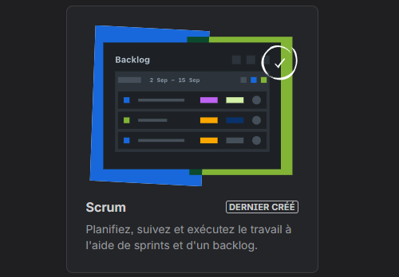
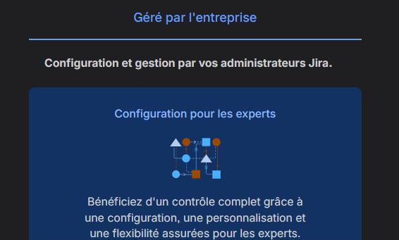
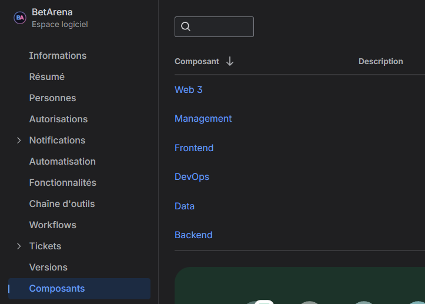
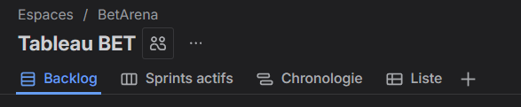
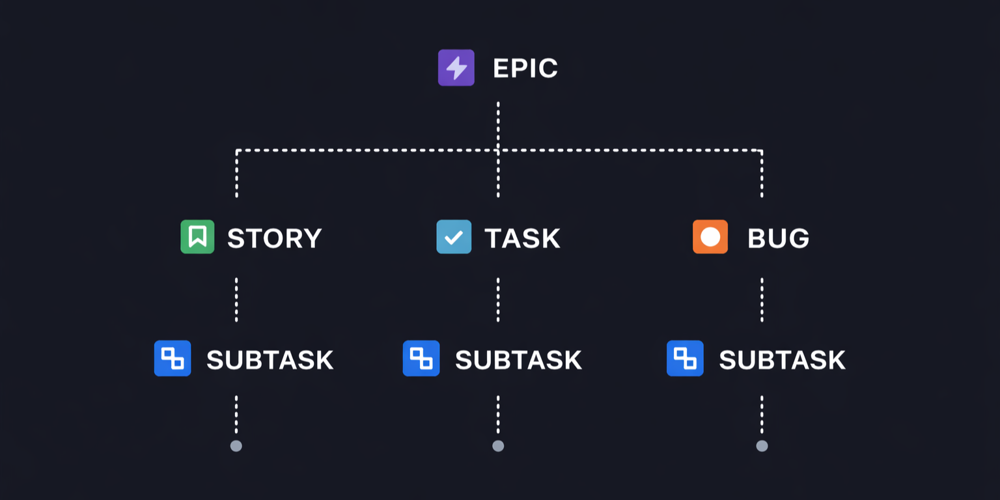
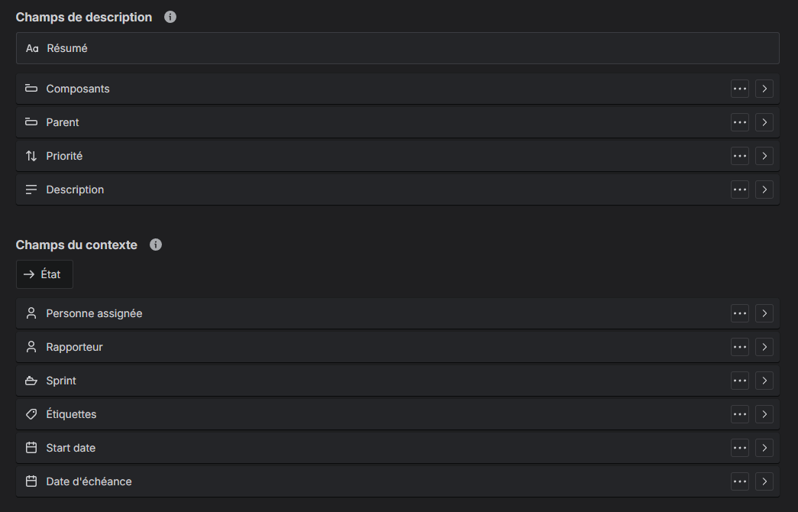
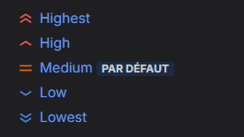

# 📋 Méthodologie & Outils de Gestion — Bet Arena

> **Date** : Février 2026
> **Projet** : Bet Arena — Simulateur de paris e-sportifs gamifié

---

## 1. Choix de la méthodologie : Agile Scrum

Nous avons choisi la **méthodologie Agile**, et plus précisément le framework **Scrum**, pour les raisons suivantes :

| Critère | Justification |
|---------|---------------|
| **Nature du projet** | Produit logiciel itératif avec des fonctionnalités évolutives — le backlog sera amené à évoluer au fil des retours |
| **Équipe étudiante** | Besoin de cycles courts pour maintenir la dynamique et la visibilité sur l'avancement |
| **Feedback régulier** | Les reviews avec l'intervenant Epitech permettent de valider la direction à chaque itération |
| **Adaptabilité** | Les incertitudes techniques (accès aux API e-sport notamment) imposent une approche flexible |

### 🔄 Cadence des sprints

Tant que le projet est en **phase de planification** (l'école nous demande de ne pas coder avant l'année prochaine), la durée d'un sprint correspond à **l'intervalle entre chaque review avec l'intervenant Epitech**. Cette cadence sera réévaluée lors du passage en phase de développement, où des sprints de durée fixe (1 à 2 semaines) seront probablement adoptés.

---

## 2. Outils de gestion : Jira (Suite Atlassian)

Notre outil principal de gestion de projet est **Jira** (Atlassian). Tous les membres du groupe y ont accès pour gérer les tâches, suivre les livrables et assurer la traçabilité du travail.

### ⚙️ Configuration de l'espace

L'espace Jira est configuré en mode **Scrum** (modèle proposé par Jira) et **géré par l'entreprise** afin d'avoir accès aux **composants**.

### 🧩 Composants

Les composants permettent de catégoriser les tickets par domaine technique :

| Composant      | Périmètre                                                 |
|----------------|-----------------------------------------------------------|
| **Management** | Gestion de projet, documentation, livrables Epitech       |
| **Frontend**   | Interface utilisateur, pixel art, responsive mobile-first |
| **Backend**    | API, logique métier, système de paris                     |
| **Data**       | Intégration API e-sport, traitement des données de matchs |
| **DevOps**     | CI/CD, déploiement, infrastructure                        |
| **Web3**       | Éventuelle intégration blockchain / tokens                |

> D'autres composants pourront être ajoutés selon les besoins du projet.

### 👁️ Vues utilisées

| Vue                        | Usage                                                                                 |
|----------------------------|---------------------------------------------------------------------------------------|
| **Backlog**                | Visualiser le backlog complet et organiser les sprints                                |
| **Sprints actifs**         | Tableau Kanban du sprint en cours (activé lors du Sprint Planning via la vue Backlog) |
| **Chronologie**            | Vue Gantt basée sur les champs *Start date* et *Date d'échéance*                      |
| **Liste**                  | Vision globale de l'ensemble des tickets                                              |
| **Rapports** *(plus tard)* | Graphiques et statistiques d'avancement (velocity, burndown, etc.)                    |

### 🎫 Types de tickets & hiérarchie

La hiérarchie des tickets, que nous avons décidé de suivre, est la suivante :

Tous les types de tickets utilisent exactement la **même disposition** :

### 🔺 Priorités

Nous utilisons les **5 niveaux de priorité par défaut** de Jira :

